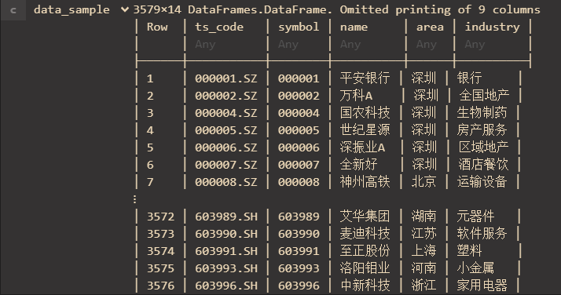

# Tushare.jl
SDK for Tushare in Julia


## Environment
Julia ver >= 1.0.0

## Package Needed
- HTTP.jl (>=0.7.0)
- JSON.jl (>=0.20.0)
- DataFrames.jl (>=0.15.0)
- YAML.jl (0.3.0) -> dangerous, may be replaced in the future.

## How to install
```
Pkg> add https://github.com/ProV1denCEX/Tushare.jl
```

## How to use
You need copy your token to the Token.txt. This .txt file needs to be placed in the same directory of your project directory.

### API supported:
All APIs in Tushare Pro
No integrated API for Daily data. It might be added in the near future.

### Data Foramt and Sample:
All Data returned by this SDK has a type of DataFrame.

The keys of the DataFrame is the fields of data.
The index varies depends on the data you acquired.
The type of data in DataFrame is Any.
For example, the data you get when you call Tushare.get_stock_list()
shows as below:


### function names that you need to call:
- get_bond_SHIBORpricing
- get_bond_wz_interestRate
- get_bond_gz_interestRate
- get_currency_basic
- get_currency_daily
- get_coin_BTmarketValue
- get_coin_BTpriceVol
- get_coin_daily
- get_coin_exchange
- get_coin_exchangeAnn
- get_coin_exchangetwitter
- get_coin_fee
- get_coin_indexConst
- get_coin_kolTwitter
- get_coin_list
- get_coin_newsBSJ
- get_coin_marketValuedaily
- get_coin_newsBTC
- get_coin_newsJinse
- get_coin_pair
- get_fund_company
- get_fund_daily
- get_fund_dividend
- get_fund_info
- get_fund_netvalue
- get_fund_portfolio
- get_future_WSR
- get_future_basic
- get_future_daily
- get_future_holding
- get_future_calendar
- get_future_settleInfo
- get_option_info
- get_option_daily
- get_stock_new
- get_stock_list
- get_stock_audit
- get_stock_daily
- get_stock_pledge
- get_stock_mainbz
- get_stock_concept
- get_stock_HSconst
- get_stock_suspend
- get_stock_delimit
- get_stock_instinfo
- get_stock_cashflow
- get_stock_top10GGT
- get_stock_HSGTflow
- get_stock_dividend
- get_stock_calendar
- get_stock_top10HSGT
- get_stock_adjFactor
- get_stock_dailyBasic
- get_stock_blockTrade
- get_stock_repurchase
- get_stock_Hotest
- get_stock_companyInfo
- get_stock_pledgeDetail
- get_stock_marginDetail
- get_stock_finIndicator
- get_stock_top10Holders
- get_stock_balanceSheet
- get_stock_marginBalance
- get_stock_conceptDetail
- get_stock_revenueForcast
- get_stock_revenueExpress
- get_stock_oldCompanyname
- get_stock_incomeStatement
- get_stock_top10Floatholders
- get_stock_disclosure
- get_stock_accountNew
- get_stock_accountOld
- get_stock_holderNum
- get_stock_moneyflow
- get_stock_holdertrade
- get_stock_announcement
- get_stock_limit
- get_other_news
- get_other_BOdaily
- get_other_BOweekly
- get_other_cctvNews
- get_other_BOmonthly
- get_other_filmRecord
- get_other_cinermaDaily
- get_other_twTechincome
- get_other_twTechincomeDetail
- get_other_teleplay_record
- get_index_info
- get_index_daily
- get_index_basicDaily
- get_index_weightMonthly
- get_index_weekly
- get_index_monthly
- get_index_classify
- get_index_member

And vip functions for corresponding APIs. For more info about Tushare api, please visit the website of Tushare.

You can modify your call via 
```
function_handle(Dict(YourParams), s_fields = fields_You_want_get)
```
For example: 
```
data_sample = Tushare.get_stock_list(Dict(), s_fields = "ts_code")
```

The params and fields' names are totally the same with Tushare SDK of Python. You can find them here: https://tushare.pro/document/2. Or read Tushare.yaml to get more information.

You can also temporarily modify your token by:
```
data_sample = Tushare.get_stock_list(Dict(), s_token = "a1sd56a6d5asd16a5d4s65a65s6d5a")
```

## How to get your token & vip
https://tushare.pro/document/1?doc_id=13


Special thanks to @three0s :)
